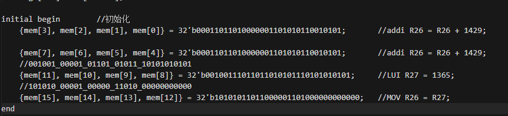
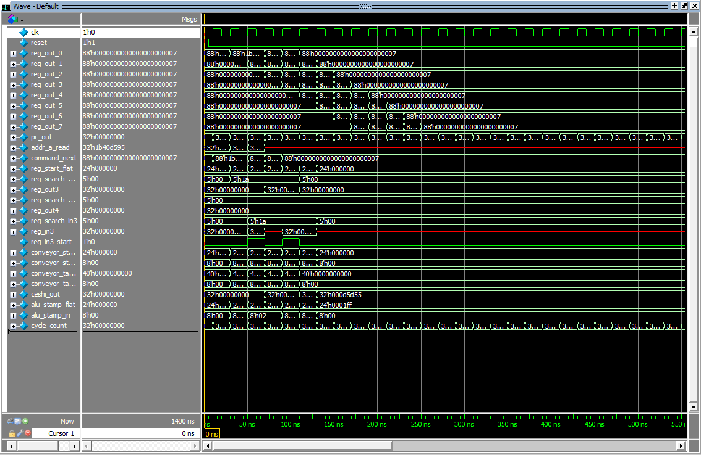
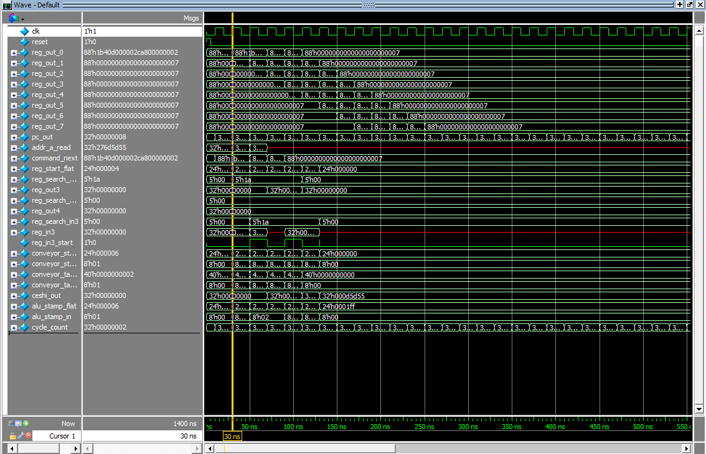
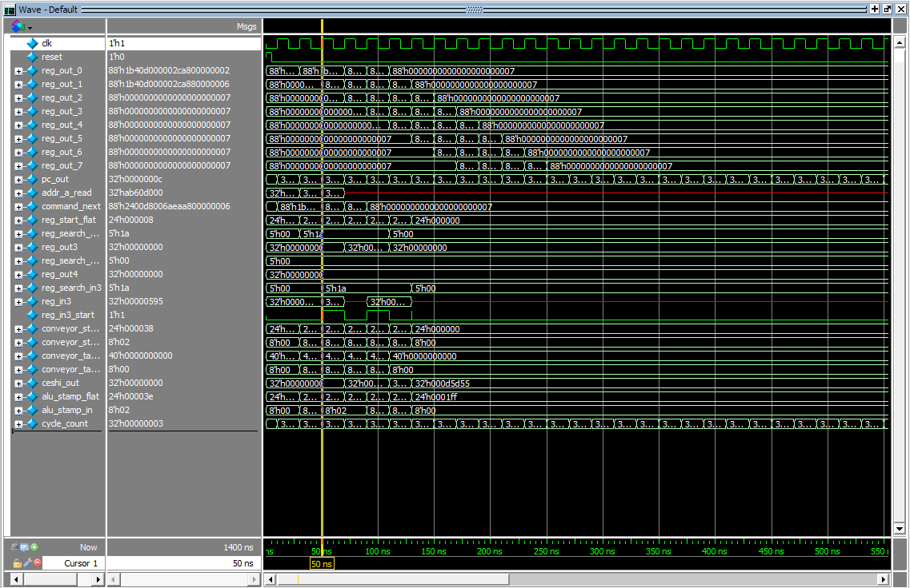
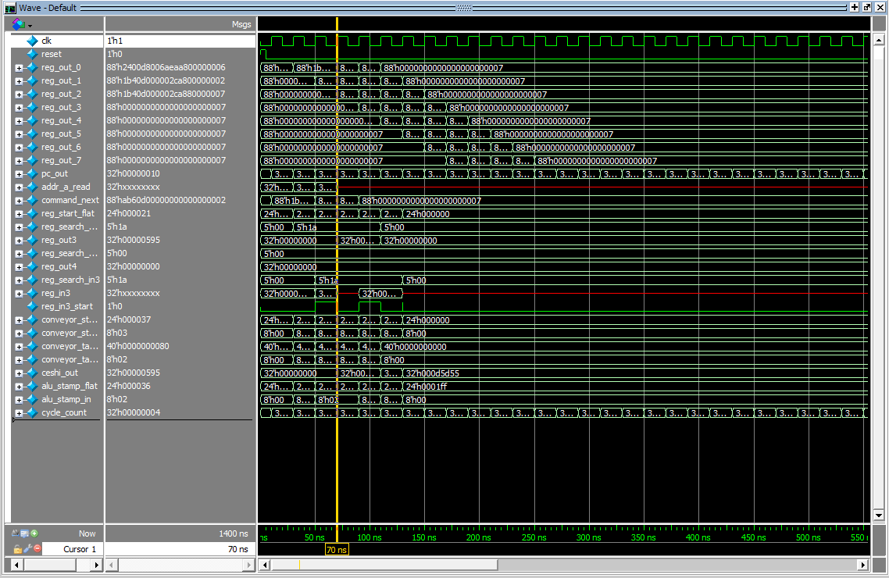
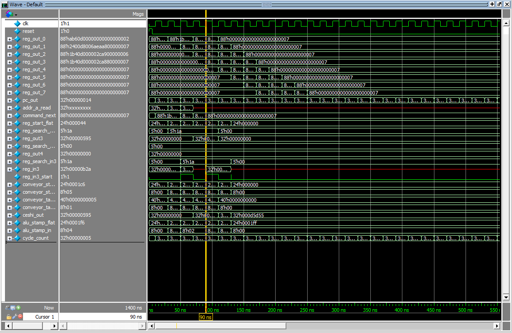
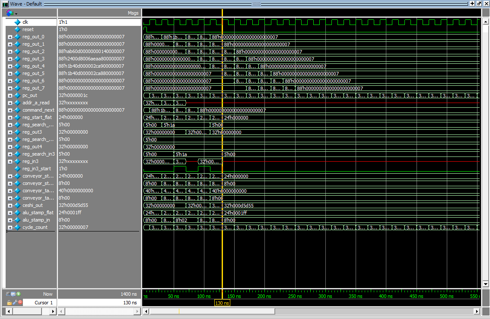

# StampFlow-10E_cpu

## 项目简介

这是一个基于创新"章机制"的RISC风格的 10发射乱序执行CPU 设计，参考部分五级流水线架构，支持无依赖指令插队代替nop实现高速度，项目目前处于开发阶段。

他有8级流水线，10发射，5个执行器：alu fpu imm jump mov

## 核心特性

- **创新章机制**：通过盖章标记指令执行状态，实现精细化的流水线控制
- **五级流水线**：取指(F)、译码(D)、执行(E)、访存(M)、写回(W) 单个指令会严格按照EMW的顺序写，但是整体允许插队
- **插队机制**：支持指令插队绕过
- **多执行单元**：ALU、FPU、跳转、移动、立即数处理等
- **资源冲突解决**：老人优先原则，避免数据冒险

## 架构示意
- 取指(PC+IM) → 译码(ID) → 传送带调度
-                         ↓       ↑
-                     （可运行指令）（写回寄存器位置和章）：执行器：执行访存写回

## 流水线描述
首先他分为取指，译码，执行，访存，写回五条结构

首先是取指，译码了之后把指令分为几个部分，执行的内容，访问的资源，以及预留三位代表三个章，三个章分别表示该条指令的执行情况执行，访存，写回这几个步骤完成了哪些，开头译码部分先检查指令不需要哪些部分提前先盖章相关的位数放入一个类似传送带的寄存器中
一条指令每个tick都会检查哪些地区空闲，前面是否有同性质的指令，前面是否有未执行完的依赖项

译码阶段就是把码翻译成执行号，访问资源，等等就是拆散便于执行

一条指令要想执行先检测前面有没有需要依赖项避免执行错误，前面有没有需要同类型的运算避免资源抢夺，以及相关执行器是否空闲，如果全部满足就送入执行器执行执行器变为1代表非空闲，并在相对应的位置盖章代表已被执行某个部分，如果出现两个执行器都空闲，单条指令都需要执行，那就先执行访存命令，如果指令前面有因为依赖项暂时没执行的命令则允许绕过他执行命令，具体就是增加一位判断他是否可执行，可执行就跳过

检测未写回就是检测该条指令需要访问的寄存器有没有被写回到内存里，如果没有就是没写回，执行运算的指令也是，检测前面未能够执行的指令中有没有和要执行的指令寄存器冲突的，如果有，那就等前面的执行完

还有运算指令也是如果检测到前面的值没有写回到内存就不要碰哪个寄存器，但是可以取他的值进行运算

*//命令锁链只向运算器输出哪些命令可用，实际选择要由运算器决定

只要把所有参与计算的寄存器保护起来，通过增多寄存器数量以及编译器的优化来实现，来避免出现资源被覆盖的情况

如果一条指令进入流水线后检测前面有无依赖项，比如未写回的内容，未访存的内容，未计算的内容，以及是否有执行器空闲，执行这条指令是否需要先后顺序，然后检测前面是否有需要同性质的计算，保持老人优先原则

## 仿真讲解：

- 这是我们要执行的指令
- 几个指令互相都会有依赖
-

- 这是我们要看的仿真图
- clk和reset分别是时钟信号和复位
- 首先是最上面的reg_out的0-7是传送带的8个传送带寄存器
- pc_out是pc加法器的输出值
- addr_a_read是取出的指令
- command_next是经过译码器输出的88位被译码的指令
- reg_start_ flat是可运行的指令列表，把他展开为二进制三个三个一组就代表每个指令的哪个阶段可被执行
- ceshi_out是测试寄存器也就是r26号寄存器的输出
-

- 第一步
- reset被拉高复位后 addr_a_read成功取指
- 

- 第二步
- command_next的内容被成功加载进传送带寄存器的0号位
- 当第一条指令进入传送带调度队列的时候他会首先因为前面没有指令所以他的执行阶段可以正确的运行
- 

- 第三步
- 传送带向前滚动一次
- 随后第一条指令的章变为110代表这条指令的执行部分已经执行完毕
- 此时第二条指令也被加载上来了
-

- 第四步
- 传送带向前滚动一次
- 此时第三条指令的执行阶段还不能正常工作，因为前面的第二条的内容还未写回到寄存器中
- 但是此时第一条指令已经成功写入到了ceshi_out中此时读数正确，是16进制数595；
-

- 第五步
- 传送带向前滚动一次
- 此时第三条指令也就是加载27号寄存器高位立即数的指令，
- 因为他没有和前面的指令的任何依赖所以他可以和第二条指令的执行阶段同步进行完成；
- 此时mov指令，也就是第四个指令也完成译码加入其中
- 

- 第六步
- 传送带向前滚动一次
- 此时mov指令因为暂时不会被第二条指令的写回卡死所以mov的执行阶段会和第二条指令的写回阶段同时进行；
- 此时第二条指令成功写回到我们监控的r26寄存器和旧值相加得出和正确为16进制数b2a；
- 此时只剩下mov的写回阶段尚未完成
- 

- 第七步
- 传送带向前滚动一位
- 此时只剩下mov的写回阶段
- 他只需要把结果写入到r26存储器就可以完整的被我们看到了
- 这个阶段执行完毕之后可以看到我们之前在27寄存器输入的数字d5d55答案
- 全部正确，验证完毕

## 主要模块

- **`top`**: 顶层集成模块
- **`pc_adder`**: PC计算和跳转控制
- **`inst_mem`**: 指令存储器
- **`if_id`**: 取指-译码阶段
- **`conveyor`**: 传送带指令调度器
- **`pool`**: 章和取信号汇集器
- **`reg_file`**: 寄存器堆(11读8写端口)
- **`alu`/`fpu`/`jump`/`mov`/`imm`**: 各功能执行单元

## 指令集
### 指令格式
- 31       26 25     21 20     16 15     11 10      0
- +----------+----------+----------+----------+----------+
- |   opcode |    rs    |    rt    |    rd    | 立即数/偏移量 |
- +----------+----------+----------+----------+----------+
-  6 bits     5 bits      5 bits     5 bits     11 bits
-  rs和rt统一为源寄存器rd为目标寄存器，除非一些特殊指令，指令结构严格按照rs，tt，rd，立即数的顺序排列

-  所有寄存器组的寻址均为5位也就是32个通用寄存器，对应真实的指令格式

  
### 指令集以及操作码(共35条指令)：

#### 运算指令：
- 加法：         000000 ADD rs, rt, rd;
- 减法：         000001 SUB rs, rt, rd;
- 与运算:        000010 AND rs, rt, rd;
- 或运算:        000011 OR  rs, rt, rd;
- 异或运算:      000100 XOR rs, rt, rd;
- 小于置位:      000101 SLT rs, rt, rd;

#### 立即数指令：
- 立即数加法:    000110 ADDI rs, rd, imm;
- 立即数与:      000111 ANDI rs, rd, imm;
- 立即数或:      001000 ORI  rs, rd, imm;
- 加载高位立即数: 001001 LUI  rs, imm   ;

#### 访存指令：
- 加载字节:      001100 LB rs rd;  //rs为要要加载哪个地址的东西，rd是加载到寄存器什么地方
- 存储字节:      001101 SB rs rd;  //rs是存储到哪个地址，rd是存储的东西

#### 分支指令：
- 相等分支:      001110 BEQ rs, rt, rd;  //rd为跳转偏移量
- 不等分支：     001111 BNE rs, rt, rd;  
- 小于等于零分支:010000 BLEZ rs, rd;
- 大于零分支:    010001 BGTZ rs, rd;

#### 跳转指令:
- 直接跳转:      010010 J    rs;         //rs为跳转偏移量
- 跳转并链接：   010011 JAL  rs rd;      //rd为要存储跳转之后的地址

#### 位移指令：
- 逻辑左移：     010110 SLL  rs, rt, rd;  
- 逻辑右移:      010111 SRL  rs, rt, rd;
- 算术右移:      011000 SRA  rs, rt, rd;
- 算术左移:      011001 CNM  rs, rt, sd;

#### 乘除法：
- 乘法：         011110 MULT rs, rt, rd;
- 除法:          011111 DIV  rs, rt, rd;

#### 浮点数运算:
- 浮点数加法:    100000 FADD  rs, rt, rd;
- 浮点数减法:    100001 FSUB  rs, rt, rd;
- 浮点数乘法:    100010 FMULT rs, rt, rd;
- 浮点数除法：   100011 FDIV  rs, rt, rd;
- 浮点数比较大于:100100 FUCK  rs, rt, rd;    //比较指令会根据结果填rd的值，如果为真则全为1，如果为假则全为0
- 浮点数比较小于:100101 FKCU  rs, rt, rd;
- 浮点数比较等于:100110 FKCK  rs, rt, rd;
- 浮点数比较不等:100111 FKNK  rs, rt, rd;
- 浮点数平方运算:101000 FAND  rs, rd;

#### 一般指令：
- 移动：        101010 MOV rs, rd;
- 取反:         101100 NOT rs, rd;

## 环境要求

- Verilog仿真器
- Verilog编译器
- 可以使用modelsim

## 快速构建
- 第一步：创建项目目录结构
- 第二步：将所有.v文件复制到该文件夹
- 第三步：开一个新项目
- 第四步：把所有的.v文件添加进去并选择verilog
- 第五步：输入vlog *.v编译所有内容
- 第六步：simulate - start sim...仿真

## 更新日志

**`2025年11月14日`**
- 修复了编译上的一些报错
- 修复了一些位宽的报错
- 把break语句全部换成了begin : **  +  disable fpu_ex的形式
- 添加简易测试平台

**`2025年11月17日`**
- 修复了一些bug可以正常运行了
- 增加了测试平台测试数量，顶层互联层优化
- 添加整理指令集
- 优化代码逻辑

**`2025年11月19日`**
-  修复了一些bug
-  修改了传送带块的检查依赖逻辑
-  新增了仿真演示
-  简洁化了下代码
